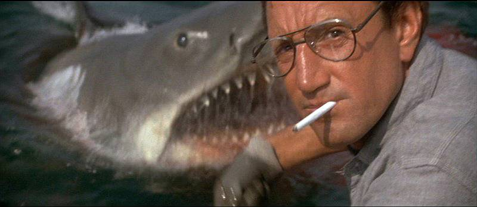

#Sharkaggle

Ironhack proyect for data cleaning with pandas

Is a general belief that sharks are one of the most dangerous animals on Earth. Despite the gruesome of this attacks, if we track the data we reach the conclusion that this is not true at all, in fact, the mosquitos are the real danger we should take care of. But, how many people is really injured and dead after a shark attack? Are there any curiosity abour this numbers. Let's check it.

The main hipothesis of this proyect is confirming the my personal idea that sharks are less dangerous than stupidity. For that reason we have checked the number of deaths "because of selfies", what in my opinion is the undisputed maximun of stupidity.
Methodology

We are going to use the data set of Kaggle about sharks, what in a first momment have to be "cleaned" carefully. For that we are going to pandas and numpy, tryng to obtain a clear table where we could have real and interesting facts.

After the cleaning, that is the main purpose of the proyect, we are going to use this data to analyze the reality of sharks attacks per country and years.
Conclusion

During the years 2011 and 2017 there have been reported 259 selfie deaths. The real number should be even higher but we could imagine only a little portion of them are reported as the families do not want accept the fact that their sibling was hopelessly stupid.